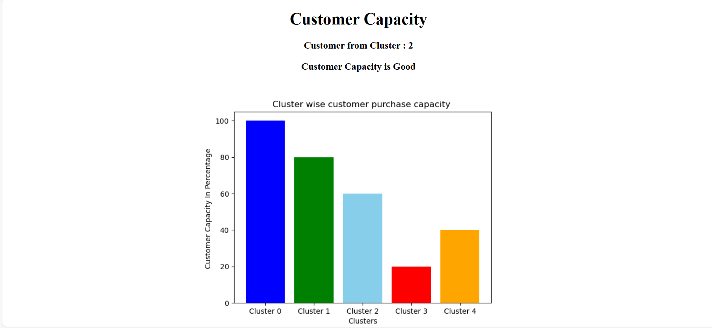

# Customer Purchase Capacity Predictor

### 📋 Description

- This Implimentation based on customer Purchase Capacity.
- Official Repository : https://github.com/pratikrathod08/Customer_Purchase_Capacity
- In this project we have used k-means clustering algorithm for cluster data in various classes.

### Dataset

- Dataset Downloaded from kaggle.
- Link for dataset : https://www.kaggle.com/datasets/sakshigoyal7/credit-card-customers

### Requirements 

- python > 3.6

### Deployment

1. docker build check
2. GitHub workflow setup
3. IAM user in AWS create
4. ECR repository create
5. EC2 instance create
6. create runner and run all codes given in ec2
7. create new secret keys
8. run runner in ec2

